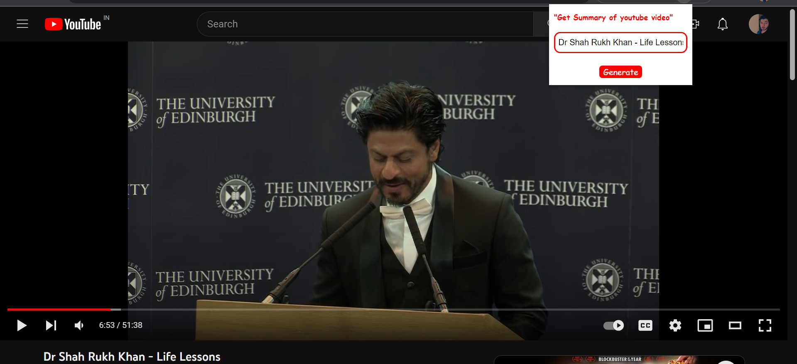
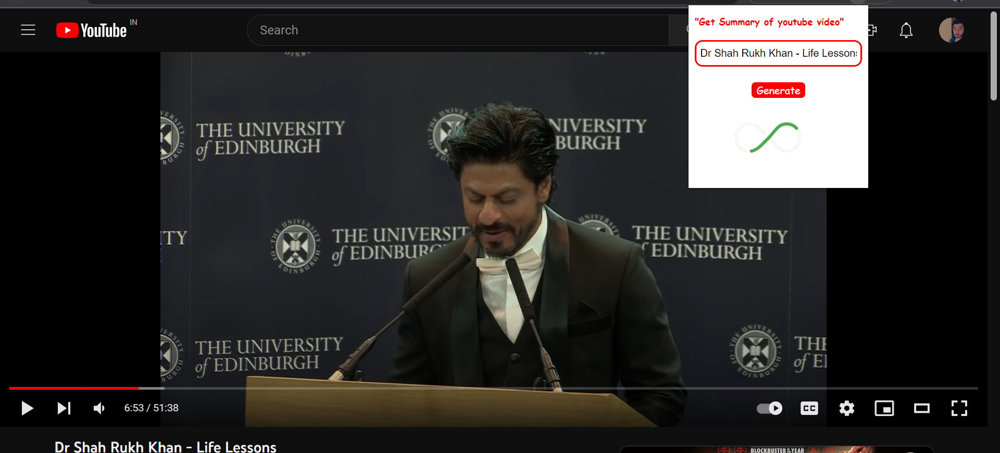

# Youtube_Summary_Chrome_Extension
Certainly! Here's a sample addReadme file for your YouTube summary Chrome extension:

<h1>YouTube Summary Chrome Extension</h1>
This Chrome extension provides a summary of a YouTube video based on its title. It is designed to help users quickly understand the key points of a video before deciding whether to watch it or not.

<h3>Installation</h3>
To install the extension, follow these steps:

<h3>Clone or download the repository to your local machine.</h3>
do npm install and run npm run dev
Open Chrome and go to chrome://extensions.
Enable developer mode by toggling the switch in the top right corner.
Click on the "Load unpacked" button and select the folder where you cloned or downloaded the repository and upload dist folder on "Load unpacked".
<h4>Usage</h4>
To use the extension, simply go to a YouTube video page and wait for the summary to appear below the video title. The summary will highlight the most important points of the video, based on its title.

<h4>How it works</h4>
The extension uses natural language processing techniques to analyze the title of the video and extract its key points. It then presents these points in a summary format below the video title.

<h4>Contributing</h4>
If you would like to contribute to the development of this extension, please feel free to submit pull requests or open issues on the GitHub repository.
